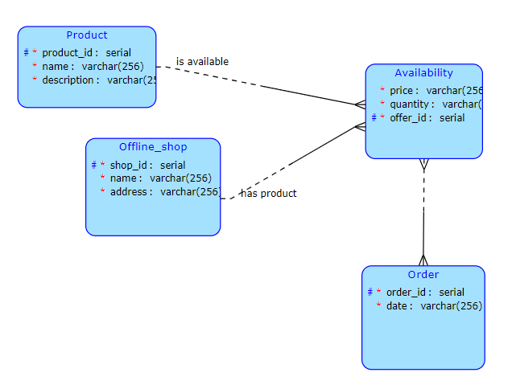

# Tjv semestral work

## Popis

Internetový obchod je služba, která pomáhá uživateli najít správný výrobek za nejnižší cenu. Služba disponuje databází desítek obchodů a nabídkou zboží s cenami. Na hlavní stránce je seznam všech produktů. Při výběru výrobku, konkrétního obchodu a množství může uživatel přidat výrobek do košíku. Na konci nakupování uživatel provede objednávku.

## Dotazy

1. Zjistěte názvy všech obchodů, které mají položky z objednávky číslo 1.
2. Transakční realizace objednávky:
    1. Získejte všechny obchody s položkami ze zadané objednávky.
    2. Získat všechny výrobky a jejich množství z dané objednávky.
    3. Pro každý obchod, ve kterém bylo něco zakoupeno, aktualizujte množství zboží 

## Spuštění:

Pro spuštění bude vyžadována nakonfigurovaná databáze:
port : 5432
POSTGRES_PASSWORD = tjv
POSTGRES_USER = user
POSTGRES_DB = tjv.
Pak stačí spustit server (který bude spuštěn na localhost:8080) Všechny závislosti jsou již uvedeny v souborech build.gradle.

## Spuštění frontendu

1. node >= v18.17.1
2. npm >= 9.6.7
3. cd OnlineShopFrontEndApp
4. npm install package.json
5. npm run dev
6. Klient bude spuštěn na http://localhost:5173/

## Popis klienta
V horní části webu jsou 4 tlačítka. V sekci zboží bude seznam všech produktů s možností 
filtrování (všechny nebo skladem). Po kliknutí na konkrétní výrobek se otevře stránka s 
nabídkami, které lze přidat do košíku. V sekci obchody se nachází seznam všech obchodů.  
V sekci objednávek se zobrazí seznam všech objednávek s tlačítkem "View my bag", 
po jehož kliknutí bude uživatel přesměrován na stránku svého košíku. Tam může některé 
nabídky ze své objednávky odstranit nebo objednávku dokončit kliknutím na tlačítko 
"Finish Order". Pokud bude v objednávce bude nabídka s množstvím 0, zobrazí se v dolní části
stránky odpovídající zpráva s žádostí o odstranění neplatných nabídek.

## Dokumentace 

1. http://localhost:8080/swagger-ui/index.html

